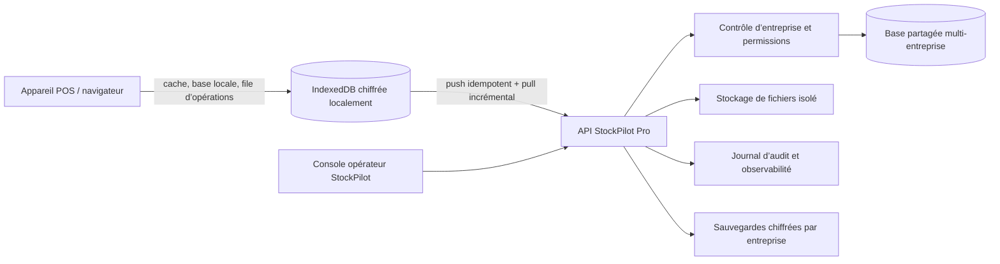

# Plan de configuration et de commercialisation SaaS

**Produit :** StockPilot Pro  
**Version du plan :** 1.0  
**Objectif :** préparer StockPilot Pro à être vendu à plusieurs entreprises, avec une expérience de gestion de stock, vente et POS fiable, sécurisée et exploitable hors connexion.

## 1. Décision directrice

StockPilot Pro doit être commercialisé comme un **SaaS multi-entreprise**. L’offre standard héberge plusieurs entreprises dans une infrastructure commune, mais chaque entreprise possède un périmètre de données, de paramètres, d’utilisateurs, de stockage et de sauvegarde strictement séparé. Un environnement dédié peut être proposé en option aux clients plus exigeants.

> Le principe n’est pas de partager les données entre clients. Il consiste à partager l’infrastructure tout en imposant une séparation logique vérifiable à tous les niveaux de l’application.

Ce modèle est cohérent avec les plateformes professionnelles : Odoo exploite une même base pour plusieurs sociétés tout en distinguant les données et paramètres liés à chaque entreprise ; Lightspeed structure les accès autour du propriétaire, des administrateurs et des rôles opérationnels ; Square traite les opérations hors connexion comme des éléments explicitement en attente, puis les synchronise lors du retour du réseau. [1] [2] [3]

| Choix | Recommandation | Justification |
|---|---|---|
| Modèle standard | Base partagée, isolation stricte par entreprise | Le plus simple à faire évoluer, à sauvegarder et à facturer. |
| Offre premium | Base ou environnement dédié | Répond aux exigences de grandes entreprises, franchises ou clients sensibles. |
| Unité opérationnelle | Entreprise → point de vente / dépôt → utilisateurs | Prépare la gestion multi-sites sans complexifier les petits clients. |
| Mode hors connexion | Offline-first sur l’appareil, synchronisation différée | Permet de continuer à vendre pendant une coupure de plusieurs jours. |
| Source de vérité | Serveur central après synchronisation | Protège la cohérence comptable, les rapports et les sauvegardes. |

## 2. État de départ de StockPilot Pro

StockPilot Pro possède déjà une base métier solide : produits, fournisseurs, clients, ventes rapides, factures, inventaires, dépenses, agents, commissions, bons de commande, documents, PWA, authentification interne, inscription d’entreprise, sessions contrôlables et premières protections multi-entreprise. Cette base permet de lancer une offre pilote, mais pas encore de promettre une isolation exhaustive ou un fonctionnement prolongé sans réseau à grande échelle.

| Domaine | Éléments déjà présents | Condition avant vente large échelle |
|---|---|---|
| Comptes | Inscription d’entreprise, administrateur initial, vendeurs, sessions révocables | Vérification d’e-mail, réinitialisation de mot de passe, MFA administrateur. |
| Multi-entreprise | Entreprise, rattachement des principaux comptes, catalogues, ventes, dépenses et réglages | Audit exhaustif de toutes les tables, routes, exports et fichiers. |
| Métier | POS, factures, stock, achats, clients, fournisseurs, agents et dépenses | Définir les limites par offre et par point de vente. |
| Hors connexion | Cache PWA, opérations locales de vente, journal de synchronisation | Migrer vers une base locale IndexedDB durable et une boîte d’envoi idempotente. |
| Exploitation | Sauvegardes, PWA, préférences et journal | Ajouter surveillance, restauration par entreprise et procédures d’incident. |
| Commercial | Parcours d’inscription et démarrage guidé | Ajouter abonnement, facturation, essais, limites d’offre et console opérateur. |

## 3. Architecture cible

### 3.1. Règle d’isolation obligatoire

Chaque ligne métier doit porter `companyId` : produits, catégories, unités, fournisseurs, clients, agents, informations vendeur, inventaires, mouvements, factures, lignes de facture, paiements, commandes, dépenses, budgets, paramètres, notifications, fichiers, exportations, sauvegardes et opérations de synchronisation.

Chaque procédure serveur doit obtenir l’entreprise active depuis une session vérifiée, puis appliquer systématiquement le filtre d’entreprise **avant** toute lecture, modification, exportation, téléchargement ou suppression. Les identifiants transmis par le navigateur ne doivent jamais suffire à sélectionner une autre entreprise.

| Contrôle | Configuration attendue |
|---|---|
| Base de données | Colonne `company_id` non nulle sur les nouvelles données métier ; index composite `company_id, id` et unicités composées lorsque nécessaire. |
| API | Middleware unique de contexte entreprise ; accès interdit lorsqu’un enregistrement n’appartient pas à l’entreprise de la session. |
| Fichiers | Clés de stockage préfixées par `company/{companyId}/...`; contrôle d’accès avant génération d’URL. |
| Cache client | Base locale limitée à une seule entreprise et un seul appareil ; purge complète lors du changement de compte. |
| Export / sauvegarde | Archive exportée et restaurée exclusivement dans le périmètre de l’entreprise concernée. |
| Tests | Tests automatiques de non-divulgation pour chaque module métier et chaque téléchargement. |

Cette séparation s’inspire du principe documenté par Odoo, où les données liées à une société ne sont accessibles qu’au sein de cette entité, tandis que les paramètres peuvent être généraux ou propres à l’entreprise. [1]

### 3.2. Structure d’organisation

La structure suivante est recommandée dès maintenant, même si les premiers clients n’ont qu’un seul magasin :

1. **Compte propriétaire** : titulaire de l’abonnement, facturation, transfert de propriété et export critique.
2. **Entreprise** : identité commerciale, devise, fiscalité, documents, abonnement et paramètres globaux.
3. **Point de vente / dépôt** : inventaire physique, caisse, imprimantes, sessions POS, seuils de stock et équipe affectée.
4. **Utilisateur** : identifiant individuel, sessions, préférences et droits.
5. **Rôle et permissions** : propriétaire, administrateur, manager, vendeur, caissier, agent commercial et rôle personnalisé à terme.

Lightspeed distingue explicitement le propriétaire, les administrateurs, managers, caissiers et rôles personnalisés ; ses permissions peuvent contrôler les produits, remises, opérations de vente, stock et rapports. Cette granularité doit guider l’évolution de StockPilot Pro. [2]

## 4. Configuration proposée pour chaque nouvelle entreprise

L’inscription doit créer une entreprise **inactive mais configurée**, puis guider le propriétaire vers un démarrage contrôlé.

| Étape | Action propriétaire | Résultat système |
|---|---|---|
| 1. Compte | Nom, e-mail, mot de passe fort, acceptation des documents légaux | Compte propriétaire, session courte, preuve d’acceptation horodatée. |
| 2. Validation | Code ou lien envoyé par e-mail | Activation du compte après vérification ; aucun envoi réel avant configuration d’un fournisseur e-mail. |
| 3. Identité | Nom commercial, adresse, téléphone, numéro fiscal, logo, devise et format de prix | Paramètres d’impression, identité facture et monnaie de l’entreprise. |
| 4. Implantation | Création du premier point de vente / dépôt | Stock, paramètres POS et utilisateurs initialisés dans ce site. |
| 5. Encaissement | Moyens de paiement autorisés, règlement partiel, imprimante et ticket | Politique d’encaissement du magasin. |
| 6. Catalogue | Premier produit, catégorie, unité, coût, prix détail / gros et seuil d’alerte | Catalogue exploitable et stock initial. |
| 7. Relations | Premier client, fournisseur et agents si nécessaire | Référentiels disponibles pour la vente et l’approvisionnement. |
| 8. Sécurité | Création des vendeurs, rôles, limites de remise et politiques sensibles | Accès opérationnels limités au rôle de chacun. |
| 9. Hors connexion | Téléchargement initial, diagnostic d’espace local et test de vente hors ligne | Appareil déclaré prêt ou incompatibilité signalée. |
| 10. Mise en service | Vente test, reçu test, sauvegarde initiale et validation | Entreprise active pour l’usage quotidien. |

## 5. Mode hors connexion réellement durable

Le cache de requêtes actuel est utile pour une consultation courte, mais il ne doit pas être la base de travail d’un POS coupé plusieurs jours. La cible est une architecture **offline-first**.

### 5.1. Base locale et données à télécharger

L’application doit utiliser IndexedDB, avec une bibliothèque transactionnelle telle que Dexie, au lieu de `localStorage` pour les données métier. Le navigateur doit demander un stockage persistant lorsque c’est possible. L’appareil ne télécharge que les données de l’entreprise et du point de vente actifs.

| Données synchronisées localement | Stratégie |
|---|---|
| Produits, prix, niveaux de stock, codes-barres | Copie complète ou incrémentale du point de vente. |
| Clients, fournisseurs et agents | Copie locale filtrée et recherche hors connexion. |
| Paramètres de taxe, paiement, impression et identité | Copie complète afin de créer des documents cohérents. |
| Vente, facture, règlement et mouvement hors ligne | Écriture locale transactionnelle avant toute confirmation utilisateur. |
| Reçus provisoires et fichiers locaux | Référence locale et réimpression possible jusqu’à synchronisation. |
| Journal de synchronisation | Conservation des opérations, tentatives, erreurs et identifiants serveur. |

### 5.2. Boîte d’envoi transactionnelle

Chaque opération produite hors ligne doit être stockée dans une **outbox** append-only avec un UUID, une version du schéma, une date, le point de vente, l’utilisateur et le `companyId`. À la reconnexion, le serveur traite cette clé comme un identifiant d’idempotence : un nouvel envoi de la même opération ne crée jamais une seconde facture ou une seconde vente.

Les ventes et mouvements de stock doivent être considérés comme des événements immuables. Le serveur attribue les numéros officiels de facture et renvoie la correspondance entre identifiant local temporaire et identifiant central. Les rapports indiquent visuellement les éléments « En attente de synchronisation », « Synchronisés » ou « À résoudre ».

Square applique un principe comparable pour les paiements hors connexion : les opérations sont stockées localement, affichées comme en attente et transmises automatiquement au retour du réseau, avec des limites explicites et des avertissements sur le risque. [3]

### 5.3. Politique de conflits

| Domaine | Politique recommandée |
|---|---|
| Vente finalisée | Événement immuable ; aucune fusion manuelle, seulement rapprochement du numéro officiel. |
| Paiement en espèces | Peut être enregistré hors ligne ; statut de synchronisation visible. |
| Paiement carte / mobile money | Ne pas promettre une autorisation hors ligne sans intégration de prestataire certifié ; marquer provisoire ou limiter au cash. |
| Stock | Décrément local avec réserve indicative ; le serveur signale une divergence ou un stock négatif à résoudre. |
| Prix, produits, paramètres | Révision serveur + date de mise à jour ; conflit affiché au manager, pas d’écrasement silencieux. |
| Clients et fournisseurs | Fusion guidée lorsque deux appareils créent un même e-mail/téléphone. |
| Suppression | Utiliser un archivage/tombstone synchronisable plutôt qu’une suppression physique immédiate. |

Le mode hors connexion doit afficher une bannière persistante, le nombre d’opérations en attente, la date de la dernière synchronisation, un bouton de synchronisation manuelle et un journal de reprise. Les équipes doivent disposer d’une procédure simple : ne pas supprimer les données de navigateur, ne pas désinstaller l’application et ne pas changer d’entreprise tant que la file n’est pas vide.

## 6. Sécurité, identité et conformité opérationnelle

La vente du produit exige une séparation claire entre le portail d’exploitation StockPilot Pro et l’espace d’une entreprise cliente.

| Sujet | Exigence de configuration |
|---|---|
| Authentification | E-mail et mot de passe haché ; vérification d’e-mail avant activation ; réinitialisation par lien à usage unique ; limitation de tentatives. |
| Administrateurs | MFA recommandé, gestion de sessions actives, notification de nouvelle connexion et révocation distante. |
| Permissions | Contrôle côté serveur ; droits spécifiques sur prix, remises, annulation, remboursement, inventaire, coûts et exports. |
| Audit | Journal inviolable des actions sensibles : auteur, entreprise, point de vente, ancienne/nouvelle valeur, heure et origine. |
| Données | Chiffrement en transit, sauvegardes chiffrées, accès administratif de support journalisé et temporaire. |
| Documents légaux | Conditions, confidentialité, politique de conservation, sous-traitants, procédure d’export et suppression. Faire valider les textes par un conseil juridique du pays de commercialisation. |
| Incidents | Procédure d’alerte, sauvegarde restaurable par entreprise et objectif de délai de reprise défini. |

Les plateformes professionnelles réservent typiquement les réglages les plus sensibles au propriétaire ou à l’administrateur et restreignent les ventes, rapports, coûts, remises et corrections par rôle. [2]

## 7. Offres SaaS recommandées

Les tarifs doivent être déterminés après étude du marché cible, du coût d’hébergement, de l’assistance et des commissions de paiement. En revanche, la structure d’offre peut être définie immédiatement.

| Offre | Client cible | Principales limites et droits |
|---|---|---|
| **Essentiel** | Commerce mono-site en démarrage | 1 point de vente, nombre limité d’utilisateurs, POS, produits, clients, factures et sauvegarde standard. |
| **Professionnel** | Commerce structuré | Utilisateurs supplémentaires, commandes fournisseur, agents, commissions, rapports, import/export, mode hors connexion renforcé. |
| **Business** | Réseau de magasins | Multi-sites, rôles personnalisés, transferts de stock, rapports consolidés, API et support prioritaire. |
| **Entreprise** | Groupe ou client sensible | Environnement dédié, SSO/MFA avancé, SLA, intégrations sur mesure, accompagnement et audit renforcé. |

Les limites doivent être vérifiées côté serveur : nombre de points de vente, utilisateurs, volume de produits, historique, appareils hors connexion et modules premium. L’interface ne doit être qu’un reflet de l’autorisation serveur.

## 8. Console opérateur StockPilot Pro

Une console interne distincte de l’application client est nécessaire. Elle ne doit jamais permettre un accès implicite aux données d’un client.

| Domaine opérateur | Actions autorisées |
|---|---|
| Entreprises | Voir l’état, plan, usage, statut de sauvegarde, suspension et archivage. |
| Abonnements | Gérer les offres, échéances, paiements, essais, coupons et factures StockPilot. |
| Support | Demande d’accès temporaire et journalisée, jamais de connexion silencieuse comme utilisateur client. |
| Sécurité | Consultation d’alertes, sessions, tentatives de connexion et état des sauvegardes. |
| Exploitation | Santé API, files de synchronisation, erreurs anonymisées et sauvegardes. |

## 9. Feuille de route de mise en service

### Phase A — Précommercialisation : fondations non négociables

1. Finir l’audit `companyId` sur toutes les tables, procédures, exports, fichiers et tâches de fond.
2. Créer les rôles propriétaire, administrateur, manager, vendeur, caissier et permissions fines.
3. Mettre en place la vérification d’e-mail, la réinitialisation, la limitation de tentatives et MFA pour les administrateurs.
4. Ajouter les journaux d’audit et la restauration d’une sauvegarde par entreprise dans un environnement de test.
5. Finaliser les conditions, la confidentialité et les règles de conservation avec validation juridique locale.

### Phase B — Offline-first : fiabilité terrain

1. Migrer le cache et la file de vente vers IndexedDB.
2. Créer une synchronisation incrémentale, idempotente et observable.
3. Ajouter le mode appareil/point de vente, le téléchargement initial et le diagnostic d’espace.
4. Créer l’écran de conflits et les procédures de rapprochement stock / vente.
5. Tester plusieurs jours sans réseau, redémarrage appareil, reprise réseau et double envoi.

### Phase C — Commercialisation SaaS

1. Créer les offres, essais, droits serveur et un système d’abonnement avec webhooks de paiement.
2. Créer la console opérateur, les alertes de facturation et les tableaux d’usage.
3. Définir l’onboarding commercial, la documentation client et la formation vendeurs.
4. Lancer un pilote limité avec quelques entreprises et recueillir les retours avant ouverture générale.

### Phase D — Croissance et grands comptes

1. Ajouter le multi-site, les transferts, les rôles personnalisés et les rapports consolidés.
2. Ajouter les intégrations comptables, paiement, matériel POS et API partenaires.
3. Proposer les environnements dédiés, SLA, SSO et accompagnement premium.

## 10. Indicateurs de préparation avant lancement public

| Indicateur | Cible de lancement |
|---|---|
| Isolation multi-entreprise | Tests automatisés de non-divulgation couvrant tous les modules critiques. |
| Sauvegarde | Sauvegarde quotidienne testée et restauration par entreprise validée. |
| Hors connexion | Vente, facture, reçu et reprise après plusieurs jours testés sur plusieurs appareils. |
| Synchronisation | Aucune duplication lors d’une répétition volontaire des mêmes opérations. |
| Sécurité | Vérification d’e-mail, réinitialisation, sessions révocables et audit des actions sensibles. |
| Exploitation | Tableau d’état, journal d’erreurs, alertes de sauvegarde et procédure d’incident. |
| Support | Documentation de démarrage, diagnostic de connexion et procédure de récupération d’appareil. |

## 11. Décisions à prendre maintenant

1. **Marché initial :** choisir le ou les pays de lancement afin d’adapter devise, taxes, documents légaux, paiement et support.
2. **Cible de départ :** commencer par les commerces mono-site avant le multi-magasin complet.
3. **Paiement :** choisir le prestataire de paiement des abonnements et séparer strictement ce paiement de l’encaissement des ventes de vos clients.
4. **Hors connexion :** valider la politique pour les paiements non-cash : limitation, mode provisoire ou intégration certifiée.
5. **Offres :** valider les limites fonctionnelles de chaque niveau avant de fixer les prix.
6. **Pilote :** sélectionner quelques entreprises réelles, avec un accompagnement direct, avant la commercialisation générale.

## Références

[1] [Odoo — Multi-company](https://www.odoo.com/documentation/19.0/applications/general/companies/multi_company.html)  
[2] [Lightspeed Retail — User roles and permissions](https://x-series-support.lightspeedhq.com/hc/en-us/articles/25534171377819-Setting-user-roles-and-permissions)  
[3] [Square — Process offline payments](https://squareup.com/help/us/en/article/7777-process-card-payments-with-offline-mode)  
[4] [Odoo — Point of Sale](https://www.odoo.com/documentation/19.0/applications/sales/point_of_sale.html)
